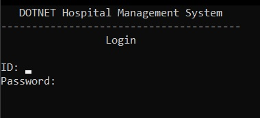
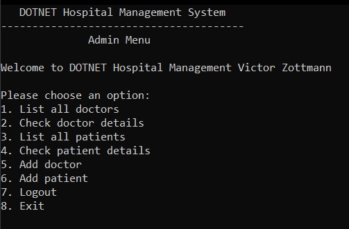
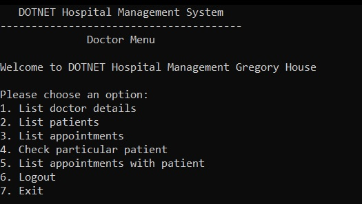
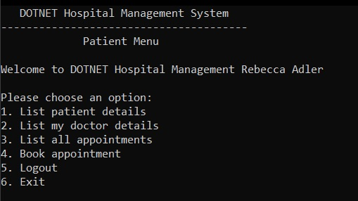

# Hospital Management System

A simple command-line-based program to manage a hospital system. 

## How to run the program

To run the program, it is necessary that you are using **`Visual Studio IDE`** on Windows and have `.NET 6.0` installed.

- **Clone this repository**
- **Open the solution in `Visual Studio`**
- **Click on the play icon to run it**

As soon as you run it, the following screen should appear:

## Login Credentials

The system only contain three types of users: Admin, Doctor, and Patient. The credentials for each user are stored in `./bin/Debug/net6.0/login-credentials.txt` and follow the formats below:

- **Admin**
  - ID: `30001`
  - Password: `admin`
- **Doctor**:
  - ID Range: `20001` - `20025` (there are 25 doctor credentials in the file)
  - All Passwords: `doc`
- **Patient**
  - ID Range: `10001` - `10025` (there are 25 patient credentials in the file)
  - All Passwords: `pat`

## User Privileges

**Note:** In addition to user-specific menu options, Admin, Doctors, and Patients share `Logout` and `Exit` features.

### Admin

Admin can view details about all doctors and patients registered in the system, as well as add new doctors and patients.

### Doctor

**Notes:** 

- Pre-defined doctors are listed in `./bin/Debug/net6.0/doctors.txt`
- Pre-defined patients are listed in `./bin/Debug/net6.0/patients.txt`
- Pre-defined appointments are listed in `./bin/Debug/net6.0/appointments.txt`
- Pre-defined doctor-patient relationships are listed in `./bin/Debug/net6.0/doctor-patients.txt`

Doctors can: 

1. See their personal details
2. See which patients are assigned to them (think of a GP - patient relationship)
3. See all appointments they have with all patients
4. Check the details of a particular patient
5. See all appointments they have with a given patient

### Patients

- Pre-defined doctors are listed in `./bin/Debug/net6.0/doctors.txt`
- Pre-defined patients are listed in `./bin/Debug/net6.0/patients.txt`
- Pre-defined appointments are listed in `./bin/Debug/net6.0/appointments.txt`
- Pre-defined doctor-patient relationships are listed in `./bin/Debug/net6.0/doctor-patients.txt`

Patients can:

1. See their personal details
2. See their doctor details
   - If they are not assigned to any doctors, a message will be displayed
   - If they are assigned to a doctor, the doctor details will be displayed
3. See all the appointments they have booked
4. Book an appointment with a doctor

